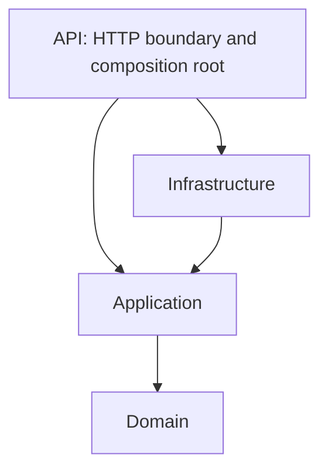

# Architecture

This is a cross-cutting architecture bootstrap, with no business use cases or external integrations.

## Why a modular monolith

One deployable ASP.NET Core application and one PostgreSQL database keep deployment,
local development, and transactions simple while the domain is still being discovered.
Explicit context contracts and schema ownership preserve boundaries without the operational
cost of distributed services. A context can be extracted later when independent scaling,
release cadence, or isolation warrants it; extraction is not a current goal.

## Dependency direction

- **Domain**: framework-free rules, small aggregates, typed identifiers, and explicit context contracts. No EF, ASP.NET, Npgsql, or Meta dependencies.
- **Application**: use cases grouped as vertical slices inside their bounded context. Depends only on Domain; define narrow persistence/integration ports only when a use case needs them.
- **Infrastructure**: EF Core/Npgsql persistence and future adapters implementing Application ports. Owns external wire models and their translation.
- **API**: request parsing, HTTP responses, and dependency composition. Its Infrastructure reference wires implementations; controllers/handlers must not contain business rules.
- **React**: delivery/UI code within `src/WhatsAppPlatform.Api/ClientApp`. Strict TypeScript; no business rules duplicated in components.

Context folders exist in Domain and Application. Application intentionally has no handlers
or DI abstraction to register yet. A future slice might live under
`Application/Organizations/<UseCase>/`, with one file per command, handler, or validator.
HTTP and persistence code for that slice stay in their corresponding outer layers.
There is no generic repository or generic unit-of-work wrapper around EF Core.

## Bounded contexts and database ownership

| Context | PostgreSQL schema | Responsibility |
| --- | --- | --- |
| Organizations | `organizations` | Customer/tenant identity and lifecycle; organization metadata |
| WhatsApp Accounts | `whatsapp` | Connected WhatsApp Business accounts and their WhatsApp-enabled phone numbers |
| Messaging | `messaging` | Messaging/payment account identity and future messaging lifecycle/use cases |
| Billing | `billing` | Partner credit-line assignments, Meta usage/liabilities, customer pricing/charges/receivables, reconciliation |
| Identity | `identity` | Platform user identity, authentication, memberships, roles, tenant authorization |
| Platform Administration | `platform` | Operator administration, platform configuration and partner setup |

One physical database is used. `database/init-schemas.sql` reserves all six schemas on
initial local database creation; there are no business tables yet. `PlatformDbContext`
is registered scoped using Npgsql. Its empty model is deliberate. The migration history
belongs to `platform`; future entity configurations explicitly call `ToTable` with the
owning schema rather than relying on the default. One migration stream initially
coordinates deployment; contexts still own their table mappings and data changes.
Future production migrations must create schemas too, rather than relying on the local
Docker initialization script. No startup `EnsureCreated` or automatic migrations run.

Schema separation is ownership, not a security or tenant-isolation mechanism. The local
Compose user is a development database owner. Production needs separate least-privilege
runtime/migration roles, secret management, TLS, backups, and reviewed migration deployment.
Tenant filtering and authorization must be added with the first tenant-scoped feature.
No such query or public business endpoint exists in this bootstrap.

Contexts reference the shared public `Organizations.Contracts.OrganizationId` type.
They may import another context's explicit contracts, never its implementation internals.
Cross-context reads/writes go through explicit Application contracts when implemented;
avoid direct access to another context's tables, navigation graphs, and aggregate internals.
Referential integrity choices must preserve context ownership rather than implying a large
aggregate spanning schemas.

## Identifiers, aggregates, and time

Internal IDs are immutable sealed records containing nonempty GUIDs. They provide value
equality and distinct compile-time types. A constructor rejects an empty ID as a programming
error; future HTTP boundaries must validate untrusted values and return expected failures
before domain construction. No factories hide random GUID generation or introduce a clock.
Future EF mappings convert each ID explicitly to PostgreSQL `uuid`.

A Meta WABA ID, messaging/payment entity ID, phone-number ID, or credit-line ID is an
external identifier with its own provider meaning. Map Meta wire DTOs to internal
contracts at the adapter boundary. Store external references separately from internal
primary keys; never reuse Graph API DTOs in Domain. Uniqueness/scoping rules must be
confirmed with the relevant Meta contract when integrations are implemented.

Persist timestamps as UTC `DateTimeOffset` using PostgreSQL `timestamp with time zone`.
Inject clocks into time-dependent domain behavior. Money is integer minor units with an
explicit currency; no float arithmetic. Async APIs accept and propagate `CancellationToken`.
No timestamped entities, money primitives, or async application APIs are needed yet.

## Hosting

A normal API build runs `npm ci` and the strict TypeScript/Vite production build, then
copies generated assets to ignored `wwwroot`. Publish includes those assets in `wwwroot`,
including on a clean checkout. ASP.NET Core serves the SPA and falls back to `index.html`
for client-side routes. Unknown `/api/*` routes remain HTTP 404. `/health/live` proves
process liveness only; it does not assert database connectivity or business readiness.

For interactive UI work, Vite proxies `/api` and `/health` to the local ASP.NET host.
Production serves both from one origin; no permissive CORS configuration is introduced.
The local host binds loopback. Configure allowed hosts and HTTPS termination explicitly
for deployment; authentication and tenant enforcement must precede business endpoints.

## Validation boundaries

The three unit smoke tests cover nonempty internal IDs, ID equality/type isolation, and
scoped Npgsql DbContext registration. They open no database connections, use no mocks,
and are fast and deterministic. Manual local HTTP and PostgreSQL checks validate bootstrap
wiring without adding an integration/E2E test suite. There is no coverage target.

Future unit tests focus on high-risk business rules, security-sensitive behavior, billing
calculations, and state transitions. Do not test framework internals or trivial accessors.
