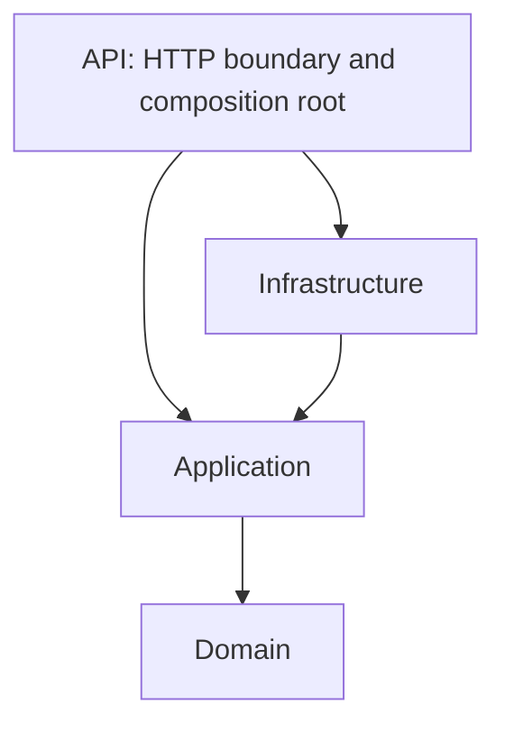

# Architecture

The bootstrap, Organization reads/creation, local WhatsApp onboarding model, and Identity security slice are implemented. External integrations remain deferred.

## Why a modular monolith

One deployable ASP.NET Core application and one PostgreSQL database keep deployment,
local development, and transactions simple while the domain is still being discovered.
Explicit context contracts and schema ownership preserve boundaries without the operational
cost of distributed services. A context can be extracted later when independent scaling,
release cadence, or isolation warrants it; extraction is not a current goal.

## Dependency direction

- **Domain**: framework-free rules, small aggregates, typed identifiers, and explicit context contracts. No EF, ASP.NET, Npgsql, or Meta dependencies.
- **Application**: use cases grouped as vertical slices inside their bounded context. Depends only on Domain; define narrow persistence/integration ports only when a use case needs them.
- **Infrastructure**: EF Core/Npgsql persistence and future adapters implementing Application ports. Owns external wire models and their translation.
- **API**: request parsing, HTTP responses, and dependency composition. Its Infrastructure reference wires implementations; controllers/handlers must not contain business rules.
- **React**: delivery/UI code within `src/WhatsAppPlatform.Api/ClientApp`. Strict TypeScript; no business rules duplicated in components.

Context folders exist in Domain and Application. Organizations now has three handlers and
one purpose-specific persistence port, `IOrganizationStore`, implemented by `EfOrganizationStore`. A future slice might live under
`Application/Organizations/<UseCase>/`, with one file per command, handler, or validator.
HTTP and persistence code for that slice stay in their corresponding outer layers.
There is no generic repository or generic unit-of-work wrapper around EF Core.

## Bounded contexts and database ownership

| Context | PostgreSQL schema | Responsibility |
| --- | --- | --- |
| Organizations | `organizations` | Customer/tenant identity and lifecycle; organization metadata |
| WhatsApp Accounts | `whatsapp` | Connected business accounts, messaging/payment metadata, phone records, and onboarding sessions |
| Messaging | `messaging` | Future message-sending lifecycle/use cases; connected payment-account metadata lives in WhatsApp Accounts |
| Billing | `billing` | Partner credit-line assignments, Meta usage/liabilities, customer pricing/charges/receivables, reconciliation |
| Identity | `identity` | Platform user identity, authentication, memberships, roles, tenant authorization |
| Platform Administration | `platform` | Operator administration, platform configuration and partner setup |

One physical database is used. `database/init-schemas.sql` reserves all six schemas on
initial local database creation. `organizations.organizations` is the first business table,
created by an explicit EF migration. `PlatformDbContext` is registered scoped using Npgsql. The migration history
belongs to `platform`; future entity configurations explicitly call `ToTable` with the
owning schema rather than relying on the default. One migration stream initially
coordinates deployment; contexts still own their table mappings and data changes.
Future production migrations must create schemas too, rather than relying on the local
Docker initialization script. No startup `EnsureCreated` or automatic migrations run.

Schema separation is ownership, not a security or tenant-isolation mechanism. The local
Compose user is a development database owner. Production needs separate least-privilege
runtime/migration roles, secret management, TLS, backups, and reviewed migration deployment.
Identity now authenticates via same-origin cookies and enforces organization membership.
PlatformAdmin can access all organizations; ordinary users see only their memberships.
Tenant-owned resources require server-resolved ownership checks; cross-tenant lookups return
404. Deployment still requires reviewed TLS, key protection, proxy/limiting, and database roles.

Contexts reference the shared public `Organizations.Contracts.OrganizationId` type.
They may import another context's explicit contracts, never its implementation internals.
Cross-context reads/writes go through explicit Application contracts when implemented;
avoid direct access to another context's tables, navigation graphs, and aggregate internals.
Referential integrity choices must preserve context ownership rather than implying a large
aggregate spanning schemas.

## Identifiers, aggregates, and time

Internal IDs are immutable sealed records containing nonempty GUIDs. They provide value
equality and distinct compile-time types. A constructor rejects an empty ID as a programming
error; future HTTP boundaries must validate untrusted values and return expected failures
before domain construction. No factories hide random GUID generation or introduce a clock.
The Organization mapping converts its ID explicitly to PostgreSQL `uuid`; future IDs follow the same rule.

A Meta WABA ID, messaging/payment entity ID, phone-number ID, or credit-line ID is an
external identifier with its own provider meaning. Map Meta wire DTOs to internal
contracts at the adapter boundary. Store external references separately from internal
primary keys; never reuse Graph API DTOs in Domain. Uniqueness/scoping rules must be
confirmed with the relevant Meta contract when integrations are implemented.

Persist timestamps as UTC `DateTimeOffset` using PostgreSQL `timestamp with time zone`.
Inject clocks into time-dependent domain behavior. Money is integer minor units with an
explicit currency; no float arithmetic. Async APIs accept and propagate `CancellationToken`.
Organization creation uses an injected `TimeProvider` in Application, with UTC millisecond
precision for stable PostgreSQL response roundtrips. Domain accepts an explicit UTC timestamp.
There are no money primitives or other business APIs yet.

## Hosting

A normal API build runs `npm ci` and the strict TypeScript/Vite production build, then
copies generated assets to ignored `wwwroot`. Publish includes those assets in `wwwroot`,
including on a clean checkout. ASP.NET Core serves the SPA and falls back to `index.html`
for client-side routes. Unknown `/api/*` routes remain HTTP 404. `/health/live` proves
process liveness only; it does not assert database connectivity or business readiness.

For interactive UI work, Vite proxies `/api` and `/health` to the local ASP.NET host.
Production serves both from one origin; no permissive CORS configuration is introduced.
The local host binds loopback. Configure allowed hosts and HTTPS termination explicitly
for deployment; cookie authentication and tenant enforcement are now implemented.

## Validation boundaries

The three existing unit smoke tests cover nonempty internal IDs, ID equality/type isolation, and
scoped Npgsql DbContext registration. They open no database connections, use no mocks,
and are fast and deterministic. Manual local HTTP and PostgreSQL checks validate bootstrap
wiring without adding an integration/E2E test suite. There is no coverage target.

Future unit tests focus on high-risk business rules, security-sensitive behavior, billing
calculations, and state transitions. Do not test framework internals or trivial accessors.

## Organizations implementation

- `Domain/Organizations/Organization` owns normalization, name validation, initial Active status, and UTC time validation. Expected creation failures return a context-specific result.
- Application slices create a typed internal ID, use the injected clock, and return `OrganizationResponse` contracts. Details returns a typed not-found outcome.
- `IOrganizationStore` contains only add, deterministic list, and ID lookup. No EF type appears in Application or HTTP contracts.
- Infrastructure owns explicit column mapping, constraints, a newest-first `(created_at DESC, id DESC)` index, and the migration/design-time factory.
- API maps POST/create and GET/list/details; invalid payloads and IDs are 400, missing roots 404, creation 201 with Location. Unexpected errors are generic Problem Details, with diagnostics confined to server logs.
- React implements list/create/details views, validates API payloads as unknown input, and handles cancellation, loading, validation failures, server failures, and successful creation.
- Listing is intentionally unpaginated and names need not be unique. Pagination, organization-create idempotency, updates, and deletion are not implemented; access control is now enforced.
- Four domain test methods add eight cases for normalization/default status/UTC time, invalid names, maximum length, and non-UTC rejection. No integration-test framework was introduced.

## WhatsApp Accounts slice

The owning context contains small account/session aggregates and independent messaging/phone
records. Organizations is referenced by its public ID and application persistence contract
for existence checks. No Organization aggregate code or collections changed. Infrastructure's
shared PlatformDbContext supplies the cross-cutting relational FK bridge to Organizations;
this is database composition, not cross-context business behavior or an EF navigation graph.
The one physical database still has one migration stream/model snapshot, so the existing
snapshot location is retained when adding the WhatsApp migration.

Application coordinates StartOnboardingSession, GetOnboardingSession, RegisterOnboardingResult,
ListWhatsAppAccounts, and GetWhatsAppAccount. IWhatsAppAccountStore is a context-specific port,
not a generic repository. Graph reads are no-tracking and batched; list queries filter by
OrganizationId and sort CreatedAt/Id descending. Detail/session routes are globally addressed
but now require authentication and server-resolved membership authorization before the handler runs.

Registration validates typed external IDs and 1–100 distinct phones, completes the domain
session, then persists the account, messaging/phone rows, and session update in one EF
SaveChanges transaction. Status is an optimistic concurrency token. Unique constraints are
the final integrity boundary; rollback clears failed tracking before checking for an existing
successful registration. Identical callbacks (including reordered phones/normalized whitespace)
return the existing account. Conflicting callbacks return 409; expired sessions return 410.

The completion HTTP contract is **temporary scaffolding**, mapped only in Development.
Session responses expose a runtime manualCompletionAvailable flag so built React assets do
not show a manual form in Production. Unknown completion fields are rejected, and DTOs have
no credential fields. No Meta HTTP adapter, SDK, embedded browser signup, or secret storage
exists. Replace this route with a trusted real Embedded Signup adapter later; do not treat
simulation data as proof of a real connection. All existing business endpoints now require
authentication; onboarding writes require OrganizationAdmin or PlatformAdmin.

Session lifetime defaults to 15 minutes via WhatsAppOnboarding:SessionLifetimeMinutes and is
validated between 1 and 1440 minutes. TimeProvider remains injected; generated timestamps use
UTC millisecond precision. The minimal UI adds account/phone state and session/manual controls
to Organization details without introducing a design system or routing dependency.

Ten focused domain test methods add eleven cases for session lifecycle, UTC time, account
creation/ownership, and external-ID validation. The existing ID smoke test also checks the
new session ID. Provider identifiers preserve opaque values and reject missing, oversized,
control-character, or invalid Unicode input. MessagingAccountId belongs to WhatsApp Accounts.
Only small unit tests are retained; deferred persistence scenarios are documented in
[future integration scenarios](future-integration-tests.md). No integration infrastructure
or coverage targets are introduced.

## Authentication and organization membership

See [authentication architecture](authentication.md) for the complete endpoint authorization
matrix, cookies, antiforgery, bootstrap, schema, and deployment tradeoffs.

Authentication → Current User → PlatformAdmin grants platform-wide access; otherwise
OrganizationMembership determines organization scope. PlatformAdmin is an Identity role;
OrganizationAdmin and Member are tenant-specific roles on independent membership records.
Domain remains free of EF, Identity, ASP.NET, and ClaimsPrincipal. Infrastructure persists
Identity and memberships; Application makes small reusable access decisions; API extracts
claims, owns cookies/antiforgery, and applies the access filter before business handlers.
Organization listing scopes the query to authorized organization IDs. Indirect account/session
lookups resolve OrganizationId from persisted ownership before reading or mutating state.

Future Meta credentials, WhatsApp operations, messaging, templates, billing, and credit-line
operations must use this same organization authorization boundary. No such features are added.
